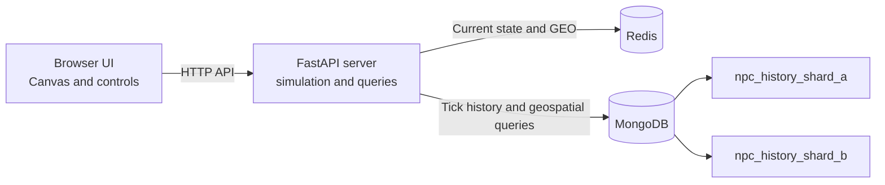

# EchoWorld

EchoWorld is a small, interactive NPC world built to demonstrate how a game-like simulation can use different NoSQL databases for live state and historical memory. Its original Nordic-inspired city has stone walls, gate towers, a raised high hall, a central market square, and distinct civic districts. Watch characters move through the city, inspect what they were doing at earlier ticks, and compare spatial queries that use a MongoDB geospatial index with a collection scan.

Each run starts with randomized NPC positions and behavior. The browser interface displays the world in a canvas and includes live and replay modes, character profiles, a Query Lab, and an anomaly alert view.

## What it demonstrates

- **Live state in Redis:** Each NPC's current state is stored as a Redis hash. Redis GEO supports nearby-character lookups.
- **History in MongoDB:** Every simulation tick is stored as a document with the NPC's position, activity, routine, zone, target, timestamp, and run ID.
- **Temporal queries:** Inspect a character's history over a tick range and see consecutive activity periods grouped into segments.
- **Spatial queries:** Find historical positions inside a radius using GeoJSON and a `2dsphere` index.
- **Index comparison:** Compare an indexed spatial query with the same query forced to scan a MongoDB collection.
- **Simple sharding model:** History is routed to one of two MongoDB collections based on NPC ID. Queries that need world-wide results gather data from both collections.
- **Anomaly detection:** A movement-speed rule detects implausible jumps. NPC_03 deliberately teleports at tick 75 to demonstrate the alert.
- **Road-aware navigation:** NPCs use A* pathfinding that favors streets, avoids building footprints, and routes through the southern gate when crossing the city wall.
- **Behavioral memory:** MongoDB history records district visits and recent flee incidents. NPCs are more likely to return to familiar districts and temporarily avoid the district where they were startled; their profile explains the latest choice.
- **Schedules and day/night:** Market workers, tavern staff, soldiers, and watch guards have different shift and sleep hours. NPCs travel to their workplace or home as their routine changes, while the accelerated world clock changes map lighting in live and replay views.
- **Scalability lab:** Increase the crowd from 12 to 120 NPCs and chart live-versus-history query latency, dual-write throughput, current-run shard distribution, and indexed-versus-scan performance.
- **Interactive exploration:** Switch between live simulation and recorded replay, select NPCs, and explore the query and alert panels.

## How it fits together



The simulation advances in ticks and writes each frame to both storage layers. Redis serves the latest NPC state; MongoDB keeps the history for replay and analysis. Each server process gets a new run ID, so replay, profiles, memory queries, and anomaly scans are scoped to that run.

MongoDB's two collections are an educational sharding model implemented by the application. This project does not configure MongoDB's built-in cluster sharding.

## Tech stack

- Python, FastAPI, and Uvicorn
- Redis for live NPC state and geospatial lookups
- MongoDB for persistent history and geospatial indexes
- Docker Compose for the database services
- HTML, CSS, and JavaScript Canvas for the browser UI

## Requirements

- Python and pip
- Docker Desktop (or Docker Engine with Docker Compose)
- A browser

The app expects MongoDB at `localhost:27017` and Redis at `localhost:6379`. These addresses are set in `src/config.py`.

## Run locally (Windows PowerShell)

1. Start Docker Desktop, then start the databases from the project directory:

   ```powershell
   docker compose up -d
   ```

2. Create and activate a virtual environment, then install the Python packages:

   ```powershell
   py -m venv .venv
   .\.venv\Scripts\Activate.ps1
   python -m pip install -r requirements.txt
   ```

3. Start the web app:

   ```powershell
   python run.py
   ```

4. Open [http://127.0.0.1:8000](http://127.0.0.1:8000). The interactive API reference is available at [http://127.0.0.1:8000/docs](http://127.0.0.1:8000/docs).

To stop the database containers, run `docker compose down`. Docker's named volumes retain their data when the containers stop.

## Try a demo run

1. Choose **Start** to watch the simulation advance in real time, or **Generate 300 ticks** to create history quickly. The clock advances ten in-game minutes per tick, so a full day passes in 144 ticks.
2. Switch to **Replay (MongoDB)** and scrub through the recorded frames.
3. Watch NPCs head to their shifts, take free time, and return home for sleep. Select an NPC to inspect its work hours, sleep hours, and historical activity.
4. Open **Query Lab** to try temporal and nearby-character queries and compare indexed and scan-based query performance.
5. Open **Scalability** to change the NPC count and inspect latency, write rate, shard balance, and the index benchmark.
6. Open **Alerts** and scan the current run for movement anomalies. The deliberate NPC_03 teleport at tick 75 demonstrates the detector.

The city starts with 12 NPCs and supports up to 120, with eight destinations and a maximum of 400 ticks per run. Positions, dwell times, destinations, and movement events use a fresh random generator for each run. At ten in-game minutes per tick, a run can cover nearly three in-game days.

## Data and reset behavior

- Starting a new server process creates a new run ID and randomized NPC state. Previous MongoDB records remain stored, but run-specific views only show the active run.
- Changing the NPC count starts a new run and keeps previous MongoDB history. The Scalability tab counts records and writes for the active run; the index benchmark also reports the total shard collection size its forced scan traverses.
- The database status counters show collection totals, so they can include history from earlier runs.
- The app's **Reset** control clears history from both MongoDB collections and clears the app's Redis state, then initializes a fresh run.
- MongoDB and Redis use Docker named volumes. Stopping the containers with `docker compose down` preserves the data; use the app's Reset control to clear the EchoWorld data.

## API overview

The full interactive schema is available at `/docs`. The main routes are:

| Method | Route | Purpose |
| --- | --- | --- |
| `GET` | `/api/meta` | World, NPC schedules, game clock, zones, and simulation metadata |
| `GET` | `/api/stats` | Database counts and current simulation status |
| `POST` | `/api/sim/configure?npcs=48` | Reinitialize the world at a chosen NPC count (12-120), preserving history |
| `GET` | `/api/scalability` | Active-run shard distribution and write throughput samples |
| `GET` | `/api/live` | Current NPC snapshot from Redis |
| `GET` | `/api/frames?start=1&end=400` | Recorded frames for the active run |
| `GET` | `/api/npc/{npc_id}` | NPC profile and history summary |
| `GET` | `/api/memory?npc=NPC_01&t_from=1&t_to=100` | One NPC's history over a tick range |
| `GET` | `/api/nearby?x=50&y=40&radius=10&t_from=1&t_to=400` | Live and historical nearby-position query |
| `GET` | `/api/index_benchmark?x=50&y=40&radius=10` | Compare indexed lookup and collection scan |
| `GET` | `/api/anomalies` | Detect implausible movement in the active run |
| `POST` | `/api/sim/start` | Start real-time simulation |
| `POST` | `/api/sim/pause` | Pause real-time simulation |
| `POST` | `/api/sim/reset` | Clear stored app data and initialize a new run |
| `POST` | `/api/sim/fast_forward?ticks=300` | Advance the simulation without real-time delays |

Coordinates `x` and `y` are expressed in world units. MongoDB records also store a GeoJSON point projected from the small world map so that geospatial operations use distances in meters.

## Project structure

```text
EchoWorld/
├── run.py                 # Starts the FastAPI app
├── requirements.txt       # Python dependencies
├── docker-compose.yml     # MongoDB and Redis services
├── src/
│   ├── server.py          # API routes and static UI hosting
│   ├── engine.py          # Randomized tick-based NPC simulation
│   ├── db.py              # Database clients, collections, and indexes
│   ├── writer.py          # Writes live state and history
│   ├── queries.py         # Temporal, spatial, and benchmark queries
│   ├── analytics.py       # Movement anomaly detection
│   ├── geo.py             # World-to-GeoJSON coordinate conversion
│   └── models.py          # NPC, world, and simulation settings
└── static/
    ├── index.html         # Browser interface
    ├── app.js             # UI behavior and API calls
    └── style.css          # Interface styles
```

## Troubleshooting

- **The app cannot connect to a database:** Check that Docker is running and that both containers are up with `docker compose ps`.
- **A database port is already in use:** Free port `27017` or `6379`, or update the matching Compose port and the connection setting in `src/config.py`.
- **Replay is empty:** Start the simulation or generate ticks first. Replay reads recorded MongoDB history for the active run.
- **Old records remain in the status counters:** Those totals include earlier runs. Use the app's Reset control to clear EchoWorld's MongoDB history and Redis state.
